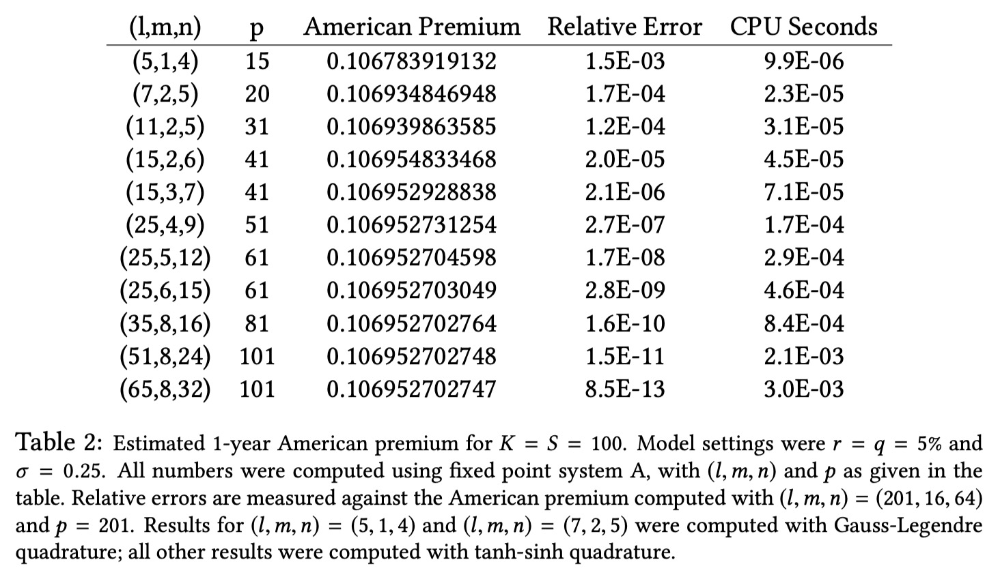

# American Option Pricing

## Project Requirement
1. Implement Spectral Collocation Method for pricing American options
2. Replicate Table 2 in the paper [High Performance American Option Pricing](/docs/High_Performance_American_Option_Pricing.pdf)

1. Analyze the results in terms of accuracy, numerical stability and convergence speed for the difference choices of model parameters l, m, n and spot price S, interest rate r, dividend q and time to maturity τ .
2. (optional) Implement Crank-Nicolson method and compare it with Spectral Collocation Method.

## Spectral Collocation Method for Pricing American Options

In this project, we implement the **Spectral Collocation Method** for pricing American options using the Jacobi-Newton iterative scheme combined with Chebyshev interpolation. This numerical method is efficient and accurate for solving free-boundary problems such as pricing American options, where the early exercise boundary must be determined.

### Overview

The Spectral Collocation Method solves for the early exercise boundary of American options by:
1. Establishing a collocation grid using Chebyshev nodes.
2. Using numerical quadrature and Chebyshev interpolation to compute boundary values iteratively.
3. Refining the boundary values using a Jacobi-Newton scheme to achieve convergence.

### Steps of the Algorithm

The complete algorithm involves the following steps:

1. **Compute Chebyshev Nodes**:
   - We compute the Chebyshev nodes $x_i$ based on the extremum points of the Chebyshev polynomial.
   - The collocation time points $\tau_i$ are determined using $\tau_i = x_i^2$, creating a grid of points for the numerical solution.

2. **Compute Quadrature Nodes and Weights**:
   - Using the Gauss-Legendre quadrature method, we compute the quadrature nodes $y_k$ and weights $w_k$ for accurate numerical integration.

3. **Initialize the Early Exercise Boundary**:
   - The initial guess $B^{(0)}(\tau_i)$ is set using an approximate method (QD+ approach).
   - The initial boundary value at $\tau_0$ is $B^{(0)}(\tau_0) = K \min\left(1, \frac{r}{q}\right)$, and subsequent values are estimated using an exponential decay model.

4. **Compute $H(\sqrt{\tau})$ and Initialize Chebyshev Interpolation**:
   - We compute $H(\sqrt{\tau}) = \left(\ln\left(\frac{B^{(j-1)}(\tau)}{K}\right)\right)^2$ at each collocation point.
   - The Chebyshev interpolation coefficients $a_k$ are determined using the discrete Chebyshev transform.

5. **Evaluate the Boundary Using Clenshaw Algorithm**:
   - For each $\tau_i$, we use the Clenshaw algorithm to evaluate the boundary values at adjusted points $\tau_i - \tau_i(1 + y_k)^2 / 4$.
   - This provides an efficient way to compute the polynomial evaluation using the Chebyshev coefficients.

6. **Compute $N(\tau_i, B)$ and $D(\tau_i, B)$ Using Numerical Quadrature**:
   - We use numerical integration to compute the numerator $N(\tau_i, B)$ and denominator $D(\tau_i, B)$ based on the integrands involving normal distributions.
   - These values are used to determine the function $f(\tau, B)$, which is central to the fixed-point iteration scheme.

7. **Compute the Derivative of $f(\tau_i, B)$**:
   - We use the closed form solution for Derivative of f 
   - This derivative is critical for the Jacobi-Newton update step.

8. **Update Boundary Values Using Jacobi-Newton Scheme**:
   - The boundary values are updated iteratively using the Jacobi-Newton formula:
     $B^{(j+1)}(\tau) = B^{(j)}(\tau) + \eta \frac{B^{(j)}(\tau) - f(\tau, B^{(j)})}{f'(\tau, B^{(j)}) - 1}$
   - The hyper-parameter $\eta$ controls the step size, ensuring stability of the iteration.

9. **Iterate Until Convergence**:
   - The algorithm iterates through steps 5 to 8 for a fixed number of iterations (typically $m$ iterations).
   - The process stops when the boundary values converge within a specified tolerance.

### Code Structure

The core implementation of the Spectral Collocation Method is encapsulated in the `DQPlus` class. Here is a brief overview of the key components:

- **`DQPlus` Class**:
  - **Initialization** (`__init__`): Sets up the option parameters and collocation grid.
  - **Boundary Initialization** (`initialize_boundary`): Initializes the early exercise boundary using the QD+ approximation.
  - **Chebyshev Interpolation** (`initialize_chebyshev_interpolation`): Computes the Chebyshev coefficients for interpolation.
  - **Clenshaw Algorithm** (`clenshaw_algorithm`): Efficiently evaluates the Chebyshev polynomial.
  - **Boundary Evaluation** (`evaluate_boundary`): Evaluates the boundary values at adjusted points using the Clenshaw algorithm.
  - **Numerical Quadrature** (`compute_ND_values`): Computes $N$ and $D$ using numerical integration.
  - **Fixed-Point Iteration** (`fixed_point_iteration`): Refines the boundary values iteratively using Newton's method.
  - **Jacobi-Newton Update** (`update_boundary`): Updates the boundary values using the Jacobi-Newton formula.
  - **Full Algorithm Execution** (`run_full_algorithm`): Executes the complete algorithm for a fixed number of iterations.

### Example Usage

The following is an example of how to use the `DQPlus` class to compute the early exercise boundary for an American option:

```python
import numpy as np
from src.dq_plus import DQPlus

# Define option parameters
K = 100       # Strike price
r = 0.05      # Risk-free rate
q = 0.02      # Dividend yield
vol = 0.2     # Volatility
tau_nodes = np.linspace(0, 1, 10)  # Collocation grid

# Initialize the DQPlus engine
dqplus = DQPlus(K, r, q, vol, tau_nodes)

# Initialize the boundary and run the full algorithm
dqplus.initialize_boundary()
final_boundary = dqplus.run_full_algorithm(m=10)

# Output the final computed boundary values
print("Final early exercise boundary values:", final_boundary)
```

### Performance and Convergence

The Spectral Collocation Method combined with the Jacobi-Newton scheme provides:
- **High Accuracy**: The use of Chebyshev interpolation minimizes interpolation errors.
- **Fast Convergence**: The Jacobi-Newton update efficiently refines the boundary values.
- **Numerical Stability**: The method incorporates safeguards against non-finite values and ensures positivity of the boundary values.

This approach is well-suited for pricing American options where accurate determination of the early exercise boundary is critical.

## Reference
https://github.com/antdvid/FastAmericanOptionPricing

https://github.com/lballabio/QuantLib/blob/master/ql/pricingengines/vanilla/qdfpamericanengine.cpp